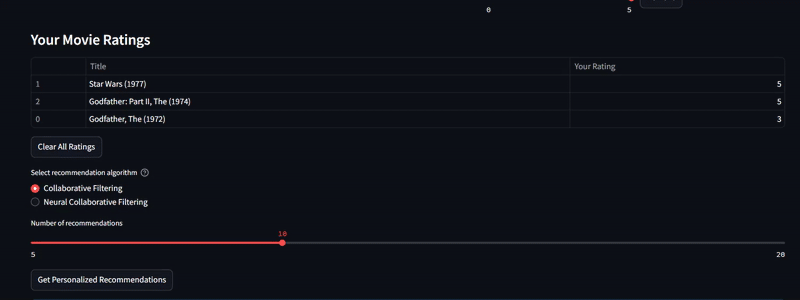

# Movie Recommendation System

A recommendation system that uses both traditional collaborative filtering (SVD) and Neural Collaborative Filtering approaches on the MovieLens dataset. The system includes a Streamlit web interface for user interaction.


- ## Video example




## Features

- Loads and processes MovieLens datasets with multiple size options:
  - MovieLens 100K (smallest, fastest)
  - MovieLens 1M (medium size)
  - MovieLens 25M (largest, most recent data)
- Implements two recommendation algorithms:
  - Collaborative Filtering using Surprise SVD
  - Neural Collaborative Filtering using Keras
- Compares performance using RMSE metrics
- Streamlit web interface with three recommendation modes:
  - User-based recommendations: Select a user ID to get recommendations based on their rating history
  - Movie-based recommendations: Select movies you like to get personalized recommendations without requiring a user ID
  - Custom recommendations: Rate any number of movies and choose between SVD or Neural Collaborative Filtering algorithms
- Interactive movie search with direct filtering in dropdown menus
- Memory-optimized for handling large datasets
- Progress indicators and status messages during model training
- Automatic sampling for better performance with large datasets

## Try it at : https://movierecommendationsystem-dzcqcbrevmqrq8ykndpwgr.streamlit.app/
(only 100k Dataset available for memory constraints)

## Installation

1. Clone this repository
2. Create and activate a virtual environment:

```bash
# Create virtual environment
python -m venv recommendation_system_env

# Activate on Windows
recommendation_system_env\Scripts\activate

# Activate on macOS/Linux
source recommendation_system_env/bin/activate
```

3. Install the required dependencies:

```bash
pip install -r requirements.txt
```

## Usage

Run the Streamlit app:

```bash
streamlit run app.py
```

Or use the included batch file (Windows):

```bash
run_app.bat
```

The application will:
1. Let you select a MovieLens dataset size (100K, 1M, or 25M)
2. Download the selected dataset on first run
3. Allow you to choose between three recommendation modes:
   - User-based recommendations: select a user ID and recommendation method
   - Movie-based recommendations: select movies you like and get personalized recommendations
   - Custom recommendations: rate any number of movies and choose between different algorithms

## Dataset Options

### MovieLens 100K
- 100,000 ratings from 943 users on 1,682 movies
- Ratings are on a scale of 1-5
- Released in April 1998
- Small and fast to load, good for testing

### MovieLens 1M
- 1 million ratings from 6,040 users on 3,706 movies
- Ratings are on a scale of 1-5
- Released in February 2003
- Medium size, good balance between data size and performance

### MovieLens 25M
- 25 million ratings from 162,000 users on 62,000 movies
- Ratings are on a scale of 0.5-5.0 (0.5 increments)
- Released in December 2019
- Most recent and largest dataset, requires sampling for better performance
- **Note**: Using this dataset requires significant memory (8GB+ recommended)

## Implementation Details

### SVD Recommender
Uses the Surprise library to implement Singular Value Decomposition for collaborative filtering.

### Neural Collaborative Filtering
Implements a neural network-based recommender system using Keras with:
- Embedding layers for users and movies
- Parallel architecture combining:
  - Matrix factorization path using dot products
  - Deep neural network path with multiple dense layers
- Adaptive network complexity based on dataset size
- Memory-optimized training with garbage collection
- Batch processing for efficient prediction

## Custom Recommendations

The system offers two ways to get personalized recommendations:

### Movie-based Recommendations
1. Go to the "Movie-based Recommendations" tab
2. Search for and select movies you like
3. Click "Get Recommendations" to receive personalized suggestions

### Custom Ratings Recommendations
1. Go to the "Custom Recommendations" tab
2. Search for movies and rate them (1-5 stars)
3. Select either "Collaborative Filtering" or "Neural Collaborative Filtering" algorithm
4. Click "Get Personalized Recommendations"

The Neural Collaborative Filtering option typically provides higher quality recommendations but requires more processing time.

## Performance Optimization

The system includes several optimizations:
- Automatic dataset sampling for large datasets
- Memory management with garbage collection
- Caching of frequently used data
- Progress indicators during long-running operations
- Error handling for large dataset loading

## Deployment

### GitHub Deployment

1. Create a GitHub repository:
   - Go to [GitHub](https://github.com) and sign in
   - Click the "+" icon in the top right and select "New repository"
   - Name your repository (e.g., "movie-recommendation-system")
   - Choose public or private visibility
   - Click "Create repository"

2. Push your code to GitHub:
   ```bash
   git init
   git add .
   git commit -m "Initial commit"
   git branch -M main
   git remote add origin https://github.com/YOUR_USERNAME/movie-recommendation-system.git
   git push -u origin main
   ```

### Streamlit Cloud Deployment

1. Sign up for a [Streamlit Cloud](https://streamlit.io/cloud) account (free tier available)

2. Deploy your app:
   - Log in to Streamlit Cloud
   - Click "New app"
   - Select your GitHub repository, branch, and the app.py file
   - Click "Deploy"

3. Configuration:
   - The app will use the requirements.txt file to install dependencies
   - The .streamlit/config.toml file contains custom settings for the app
   - For large datasets, use the sampling feature as Streamlit Cloud has memory limitations

4. Advanced options:
   - Set secrets through the Streamlit Cloud dashboard if needed
   - Configure the app to use specific Python version if required

5. Sharing:
   - Once deployed, Streamlit Cloud provides a public URL to share your app
   - You can set up authentication through Streamlit Cloud if you want to limit access

Note: Due to memory constraints in the free tier, it's recommended to use the 100K dataset for public deployments. The 25M dataset may exceed memory limits on free hosting services.

## Data Source

The MovieLens datasets are maintained by the GroupLens research group at the University of Minnesota and are widely used for research on recommender systems. Visit [grouplens.org/datasets/movielens](https://grouplens.org/datasets/movielens/) for more information. 
